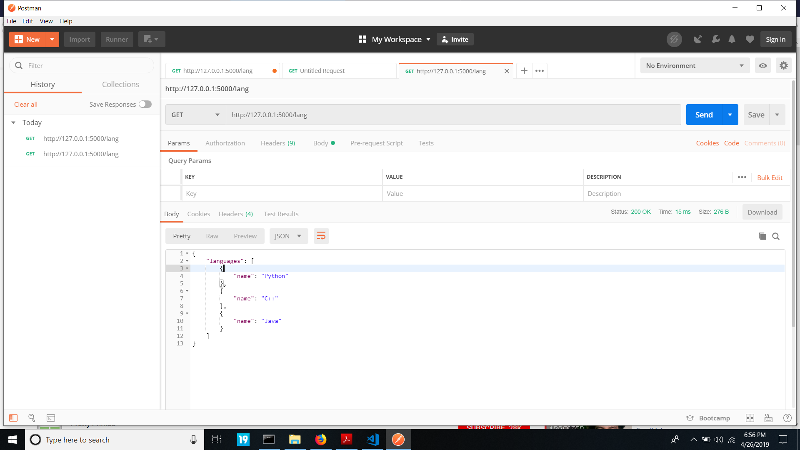

# RESTful-API-with-Flask
A crude RESTful API built using Flask (A Python Microframework)

GET, POST, PUT, DELETE operations using a RESTful API on a list which comtains languages in the form of dictionaries defined as key-value pairs.

### 1. Home page

### 2. GET Request

#### Sending a GET Request to retrieve all the languages in the list

### 3. POST Request

#### Sending a POST request to add JavaScript to the list of languages

#### Result after the POST request 

### 4. PUT Request

#### All the languages in the list

#### Sending a PUT request to update 'Java' language with 'Go' in the list of languages

#### List of languages shows that 'Java' has been replaced with 'Go'

### 5. DELETE Request

#### Sending a DELETE request to delete 'C++' from the the list of languages

#### List of languages after deleting 'C++'

